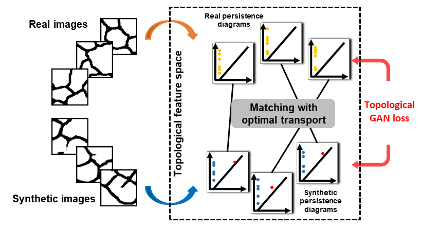

# TopoGAN: A Topology-Aware Generative Adversarial Network #

[**Fan Wang, Huidong Liu, Dimitris Samaras, Chao Chen, ECCV 2020.**]  
Project page (https://seravee08.github.io/TopoGAN-ECCV2020/)  
Paper (https://www.ecva.net/papers/eccv_2020/papers_ECCV/papers/123480120.pdf)

Most existing generative adversarial networks (GANs) focus on generating realistic images with regard to CNN-based image features, but fail to preserve the structural properties of real images. This can be fatal in applications where the underlying structure (e.g., neurons, vessels, membranes, road networks) of the image carries crucial semantic meaning. In this paper, we propose a novel GAN model that learns the topology of the real images, i.e., connectedness and loopy-ness. In particular, we introduce a new loss that bridges the gap between synthetic image distribution and real image distribution in the topological feature space. By optimizing this loss, the generator produces images with the same structural topology as real images. We also propose new GAN evaluation metrics that measure the topological realism of the synthetic images. We show in experiments that our method generates synthetic images with realistic topology. We also highlight the increased performance that our method brings to downstream tasks such as segmentation.

 

 

 

TopoGAN is tested under Windows10 and ran on jupyter notebook with pytorch support.  

### 1. Requirements ###
TopoGAN requires following libraries to run:
- argparse
- shutil
- pathlib
- glob
- cv2
- os
- numpy
- torch
- scipy
- struct
- PIL
- torchvision
- sys
- time
- random
- matplotlib
- skimage
- pot
- math
- copy
- persim
- mpl_toolkits
- cvxopt

Besides above required libraries, you will need persistent homology computation that can output cycle information
and critical points. We provide a complied version used in the paper in the form of a python module under folder
persis_lib_cpp. If you are interested to use it as a standalone module, import it with the following lines:
- import sys
- sys.path.insert(0, './persis_lib_cpp')
- from persis_homo_optimal import *
The defination of the interfaces are given in persis_lib_cpp/PersistenceComputer.h

### 3. Datasets Download ###
The datasets used in the paper are:
- CREMI (https://cremi.org/data/)
- ISBI
- Google Maps
- Facades
- Retina
The datasets are preprocessed and subsampled to have a smaller patch size and compatible form.
The persistence diagrams of the training images should be pre-computed with the function "FileIO.compute_pd_save"
An example is given in the Main.ipynb.

### 5. Hyperparameters ###
The hyperparameters of TopoGAN are all defined in file: Archpool.ipynb.
TopoGAN supports easy change of network architecture. The default architectures are DC GANs (index 2 and 3 in Archpool).
TopoGAN works better with ResNet (also provided in Archpool).

Some important hyperparameters are explained here:  
return_advanced_params:  
Topo_edge:  
(1) target_topo_dimension: 1 for cycles (most cases), 0 for connected components  
(2) topology_loss_weight: the weight of topology loss  
(3) use_blind_force: use False  
(3) project_2_dim: 0 (match birth, target_topo_dimension has to be 1), 1 (match death, target_topo_dimension has to be 0)  
(4) image_watershed: image binarization threshold  
(5) target_topo_threshold: the threshold to filter noisy topological strutures. If set too large, there could be nothing left (cause program error)  

return_settings:  
Basic:  
(1) branch_name: the name of the folder where the logs are saved  
(2) continue_model: if to train model based on previous models  
(3) model_step: if continue_model is true, indicate the model you want to load  

Path:  
(1) save_path: where to save models and log files  
(2) data_path: the folder where there are training images  
(3) pds_path: the folder where there are computed persistence diagrams  
